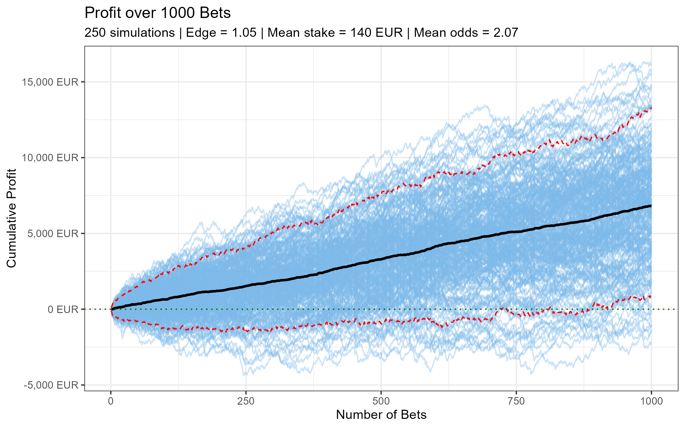
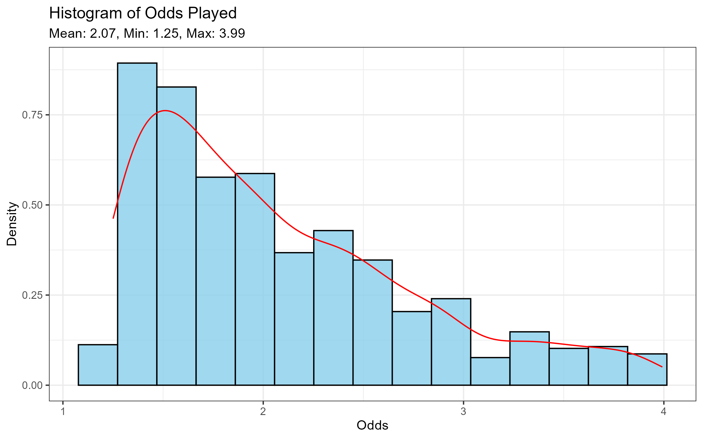

<!-- badges: start -->
[](https://github.com/willewiik/betRBall/actions/workflows/R-CMD-check.yaml)
<!-- badges: end -->

# betRBall

An R package for football betting calculations.


## Installation

You can install the development version of `betRBall` from GitHub with:

``` r
devtools::install_github("willewiik/betRBall")
```

## Example 1

```{r example}
library(betRBall)

# Generate a Poisson goal probability grid with expected goals for home and away teams
grid <- poisson_goal_grid(exp_home = 1.5, exp_away = 1.2)

# Calculate Asian handicap odds for line -0.25
handicap_odds <- asian_handicap_odds(grid = grid, line = -0.25)
print(handicap_odds)
# [1] 1.934441 2.070158

# Calculate Asian total goals odds for line 3.25
total_odds <- asian_total_odds(grid = grid, line = 3.25)
print(total_odds)
[1] 3.064306 1.484424
```


## Example 2

```{r example}
library(betRBall)

# Run a simulation with:
# - 1000 bets
# - 500 simulations
# - 5% edge 
result <- sim_bets(n_bets = 1000, n_sim = 500, edge = 1.05)

# Plot the cumulative profit across all simulations
result[["profit_plot"]]

# Plot the distribution of odds used in the simulations
result[["odds_plot"]]

```

## Plot ouputs

Plot output for the function `sim_bets()`

### Profit Plot


### Odds Distribution Plot



